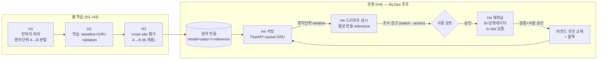

# sepsis-mlops

재사용 가능한 MLOps 스켈레톤을 **환자 시계열 → 실시간 패혈증 조기경보** 문제에
적용한 저장소. PhysioNet/CinC 2019 챌린지 데이터를 사용한다. 도메인 이전(domain-transfer)
MLOps 저장소 시리즈의 세 번째다(`pdm-mlops`, `chest-xray-mlops` 다음).

> **포지셔닝**: 목표는 "최고의 패혈증 모델"이 아니라 **"배포해도 안 무너지는, 운영 가능한
> AI 시스템"**이다. 리서처는 모델 점수(0.98!)를 좇지만, 실제로 생명을 구한 TREWS와 실패한
> Epic의 차이는 모델이 아니라 **운영 설계**였다. 그 운영 레이어가 이 프로젝트의 본체다.

**진행 상태**: 리서치/설계 근거(Q1–Q5) ✅ · EDA·스모크 ✅ · 풀 학습 **H1→H2→H3** ✅ ·
운영 **H4(서빙·드리프트·재학습)** ✅ — **MLOps 루프 폐쇄**. 설계 전문은 [`design/`](design/README.md),
서빙·확장 인프라 결정은 [`docs/adr/`](docs/adr/serving-scaling.md).

---

## 관통하는 하나의 주제

다섯 개 설계 질문의 결론이 따로 노는 게 아니라 하나의 철학으로 꿰인다:

> **"시험은 잘 보는데 실전에선 무너지는" 가짜 성능을 막고, 실제로 배포 가능한 시스템을 만든다.**

- **피처·전처리(Q2)**: 컨닝 단서(ICULOS) 차단, 누수 통로(결측 마스크) 신중.
- **평가(Q3)**: 불균형·타이밍을 정직하게 재고, 새 병원 일반화를 처음부터 측정.
- **누수(Q4)**: 막을 수 있는 건 막고, 못 막는 건 인지하고 운영으로 관리.
- **운영(Q5)**: 모델 점수가 아니라 배포·운영 설계가 실제 성과를 만든다.

---

## 풀 파이프라인 (H1–H4) — 구현 완료

설계는 **3단계 게이트**로 진행했다: 설계결정문서(DDD) → **레드팀 검토**(HOLD면 구현 중단) →
자립형 핸드오프 → 구현(토막마다 프로그램적 assert 스모크 게이트). 전체 설계·검토·핸드오프
문서는 [`design/`](design/README.md), 측정 결과는 [`reports/`](reports/).



| 스테이지 | 한 일 | 핵심 결과 |
|---|---|---|
| **H1** 전처리·피처·분할 | 환자단위 A→B 분할, train-only 정규화, ffill→train-mean(**0-fill 금지**), 마스크 OFF, ICULOS 제외, m2m 시퀀스 | 누수 차단 셋업 |
| **H2** 학습 | XGBoost/LightGBM(NaN-native) vs **GRU m2m**(causal), 6조합, 공식 utility | **GRU/vitals A-val util 0.4087**(트리 우위) |
| **H3** cross-site (B 개봉) | A→B 일반화 직접 측정, 공식 채점 동등성, 마스크 ablation | **GRU/vitals B util 0.2466**(xgb 0.055), vitals>vitals_labs, **마스크 OFF 확정** |
| **H4 서빙** | 실시간 causal GRU, A-동결 전처리, 원자 번들, Prometheus | train-serving **skew 0** |
| **H4 드리프트** | 거리지표(PSI/JS/Wasserstein), 환자당 1관측, 경험적 보정, **watch 전용** | KS 폴백 차단, **활성 번들 reference**(롤백과 함께 이동) |
| **H4 재학습** | 드리프트 주도·**사람 승인**, B=운영데이터(환자분할), in-dist 검증, 버전드 교체·롤백 | **B-holdout util 0.2488**, A-val 무회귀 OK, **자동 교체 0건** |

> **평가 기조**: 정확도 버림(양성 1.8%). **PR-AUC + 공식 utility score + cross-site(A→B)**로
> 일반화를 직접 측정 — "점수"가 아니라 "배포해도 안 무너지는가". cross-site 봉인(B)·train-only·
> human-in-the-loop를 코드 게이트로 강제.

### 서빙·확장 아키텍처 결정 (ADR)

H4 서빙·운영의 **인프라 선택마다 "규모 기반 근거"**를 정리한 결정 문서:
[`docs/adr/serving-scaling.md`](docs/adr/serving-scaling.md). 핵심은 "도구를 안 쓴 건
몰라서가 아니라 규모에 안 맞아서"라는 *시점 판단*이다.

| 영역 | 결정 | 핵심 이유 |
|---|---|---|
| 모델 버전 관리 | 자체 번들 (MLflow Registry ❌) | 번들(model+stats+τ+reference) **원자 교체**가 필요 — Registry는 모델-단위 |
| 서빙 포장 | 커스텀 번들 (pyfunc ❌) | pyfunc는 정적 짐만, **hidden state**는 못 가둠 |
| 서빙 프레임워크 | FastAPI 자체 (Triton ❌) | CPU 단일 노드엔 Triton이 오버킬 |
| 추론 하드웨어 | CPU (GPU ❌) | 작은 GRU 단일추론은 CPU가 오히려 유리 |
| 확장 경로 | K8s scale-out + Redis 외부화 (측정 후) | stateful이라 상태 외부화 필요, **measure-then-scale** |
| 장애 대비 | Redis HA: AOF→복제→Sentinel (경로) | 단일 Redis는 SPOF, 의료 무중단 요건 |

### 재현 — 토막별 스모크 게이트

각 구현 토막은 프로그램적 assert로 닫힌다(데이터·MLflow 런 필요):

```bash
uv run python -m scripts.h4r_a_smoke         # watch→action 조사권고 + 지연라벨 백필
uv run python -m scripts.h4r_b_smoke         # 재학습 (B=운영데이터, in-distribution 검증)
uv run python -m scripts.h4r_c_smoke         # 버전드 안전 교체 + 롤백
uv run python -m scripts.h4_drift_loop_smoke # 서빙이 활성 번들 reference로 드리프트 관측
```

---

## 리서치 개요 — 다섯 질문과 결론

설계 결정은 "추측"이 아니라 **데이터 + 선행연구 1차 출처** 위에서 내렸다. 각 문서는
주장마다 출처 등급(확인됨 / 유도 / 우리 결정 / 검증 필요)을 달았다. 전체 인덱스와 공통
범례는 [`research/`](research/README.md) 참고.

| | 질문 | 한 줄 결론 | 문서 |
|---|---|---|---|
| **Q1** | 어떤 모델? | baseline=**XGBoost/LightGBM**, 메인(운영)=**GRU**, 욕심=Transformer. 진짜 난관은 모델이 아니라 **병원 간 일반화**. | [01_models](research/01_models.md) |
| **Q2** | 뭘 먹이고 빈칸은? | 활력징후+나이·성별 기본, 피검사는 핵심만. 결측은 **모델별 분기**(XGBoost는 NaN 그대로, GRU는 forward-fill). **0-fill 금지.** 결측 마스크는 누수 위험으로 **기본 OFF·옵트인**. | [02_features_missing](research/02_features_missing.md) |
| **Q3** | 성공을 뭘로 재나? | 정확도 버림(불균형), AUROC 보조, **PR-AUC 1차**, **utility score 정식**(1=완벽·0=무행동·음수=해로움), **cross-site(A→B)**. | [03_evaluation](research/03_evaluation.md) |
| **Q4** | 누수·일반화 함정? | 컨닝 길 4개 — ①시간단서 ②**치료행동 누수** ③병원 일반화 ④환자분할. ①④는 처리, **②③은 인지+운영으로 관리**. | [04_leakage_generalization](research/04_leakage_generalization.md) |
| **Q5** | 어떻게 굴리나? | 성패는 모델이 아니라 **운영**이 가른다(Epic 실패 vs TREWS 사망률 18%↓). 실시간 서빙·알림률·**입력 드리프트 감시**·재학습(피드백 루프 인지)·배포 전 cross-site. | [05_serving](research/05_serving.md) |

### 핵심 설계 결정 요약

- **모델 3종**: XGBoost(baseline) / GRU(메인·운영) / Transformer(욕심). 비교는 메인을 정당화하는 도구지 목적이 아님.
- **결측 처리 분기**: XGBoost는 native NaN, GRU는 forward-fill + train-mean + 정규화(train-only). zero-fill 금지(0=사망 같은 진짜 값).
- **결측 마스크**: 기본 미사용. 치료행동 누수 위험으로 옵트인 — 두 검증(A→B 전이 / 발병 전 한정 평가) 통과 시에만.
- **평가**: PR-AUC(1차) + utility score(정식) + cross-site A→B. 정확도 버림, AUROC 보조.
- **누수 정책**: ICULOS 등 시간단서 제외, 직접 치료행동 피처 금지(데이터에 없음), 환자 단위 분할, train-only 정규화. 치료행동·병원 일반화는 인지 + 운영 관리.
- **운영**: 실시간 서빙(FastAPI/GRU), 알림률 튜닝, 입력 드리프트 감시(Evidently/Grafana), 재학습(MLflow, 피드백 루프 인지), 배포 전 cross-site.

---

## 데이터

- **출처**: PhysioNet/CinC Challenge 2019 — *Early Prediction of Sepsis from
  Clinical Data*. 공개 데이터이며 별도 인증 불필요.
- **구조**: 환자 1명당 `.psv` 파일 1개(파이프 구분), 한 행 = ICU 1시간;
  41개 컬럼 = 40개 피처 + `SepsisLabel`.
  - `data/raw/training_setA/` — 환자 20,336명 (병원 A)
  - `data/raw/training_setB/` — 환자 20,000명 (병원 B)
- **커밋 안 함** — `data/`는 git-ignore. 재현 방법:

  ```bash
  bash scripts/download_data.sh    # 약 315 MB, PhysioNet S3 미러에서 40,336개 파일 전부 내려받음
  ```

## EDA & 스모크 파이프라인

```bash
uv sync
uv run python scripts/eda.py          # EDA: 콘솔 리포트 + reports/eda_findings.md + reports/figures/*.png
uv run python -m smoke.train_smoke    # 스모크: 1000명 CPU 서브셋으로 end-to-end 배선 검증
```

작성 내용은 **[reports/eda_findings.md](reports/eda_findings.md)**(EDA)와
**[reports/smoke_findings.md](reports/smoke_findings.md)**(스모크) 참고. EDA 핵심 수치:

| | |
|---|---|
| 환자 수 (A / B / 합계) | 20,336 / 20,000 / 40,336 |
| 환자-시간(행) | 1,552,210 |
| 패혈증 환자 (양성 시간 ≥1) | 7.27% |
| 양성 환자-시간 | 1.80% (음성:양성 ≈ 55) |
| ICU 체류 중앙값 | 38시간 |
| 양성 라벨 구간 | 연속, ≤10시간, 기록 끝에서 종료 (전체의 100%) |
| 최악 결측 | 검사 >90% NaN; 활력 10–66% NaN |

---

## 환경

WSL2 Ubuntu · `uv` + `pyproject.toml` · `pandas`, `numpy`, `matplotlib`.
