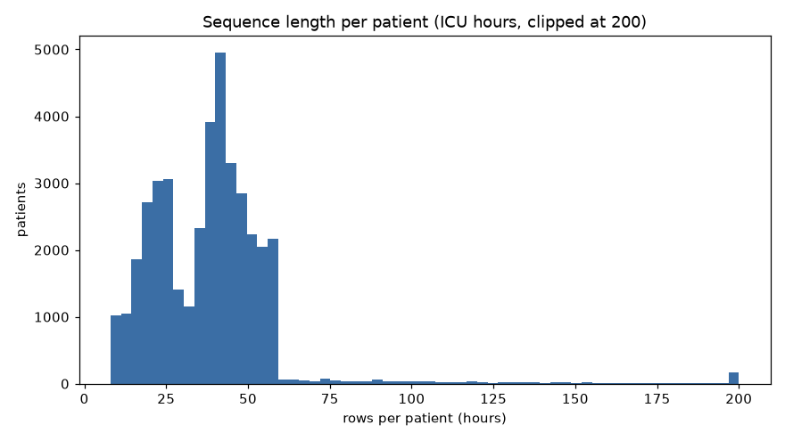
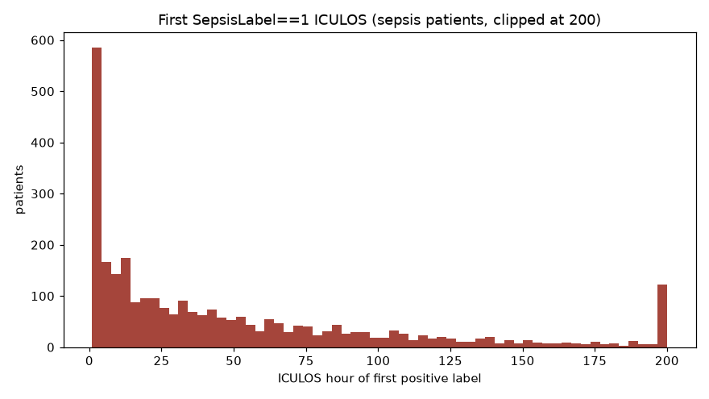
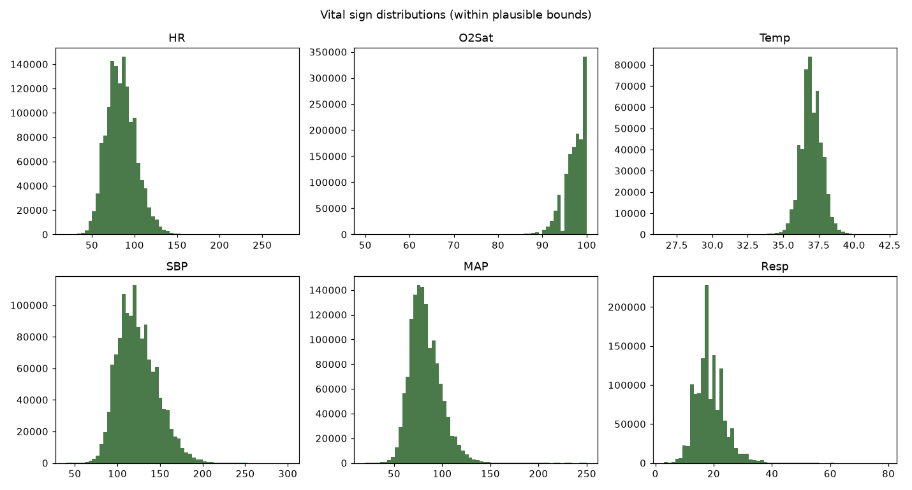

# PhysioNet 2019 Sepsis — EDA Findings

> Exploratory measurement only. No imputation, no modeling, no splitting. All patient-level stats aggregated per `.psv` file (= one patient) to avoid leakage in the statistics.

## 1. Inventory
- `training_setA`: **20336** patients · `training_setB`: **20000** patients · **total 40336** patients
- Total patient-hours (rows): **1,552,210**
- Files skipped for header/parse mismatch: **0**

## 2. Columns / types
- All files carry the expected **41 columns** (40 features + `SepsisLabel`), pipe-separated, `NaN` for missing. dtypes are float64 except integer-coded `Gender`/`Unit1`/`Unit2`/`ICULOS`/`SepsisLabel` (read as float when NaNs present).
- `ICULOS` strictly increases within a patient in **40336/40336** files (100.0%) — confirms one row = one ICU hour, time-ordered.

## 3. Missingness (per-row)
| column | missing % | patients fully missing |
|---|---:|---:|
| Bilirubin_direct | 99.81% | 38,279 |
| Fibrinogen | 99.34% | 35,821 |
| TroponinI | 99.05% | 33,283 |
| Bilirubin_total | 98.51% | 26,088 |
| Alkalinephos | 98.39% | 26,163 |
| AST | 98.38% | 25,979 |
| Lactate | 97.33% | 27,843 |
| PTT | 97.06% | 20,098 |
| SaO2 | 96.55% | 27,248 |
| EtCO2 | 96.29% | 37,120 |
| Phosphate | 95.99% | 12,015 |
| HCO3 | 95.81% | 20,119 |
| Chloride | 95.46% | 18,925 |
| BaseExcess | 94.58% | 27,126 |
| PaCO2 | 94.44% | 21,980 |
| Calcium | 94.12% | 5,339 |
| Platelets | 94.06% | 2,577 |
| Creatinine | 93.90% | 2,049 |
| Magnesium | 93.69% | 4,931 |
| WBC | 93.59% | 2,625 |
| BUN | 93.13% | 2,018 |
| pH | 93.07% | 21,401 |
| Hgb | 92.62% | 2,448 |
| FiO2 | 91.67% | 22,527 |
| Hct | 91.15% | 2,317 |
| Potassium | 90.69% | 1,867 |
| Glucose | 82.89% | 1,580 |
| Temp | 66.16% | 284 |
| Unit1 | 39.43% | 15,617 |
| Unit2 | 39.43% | 15,617 |
| DBP | 31.35% | 7,411 |
| Resp | 15.35% | 71 |
| SBP | 14.58% | 282 |
| O2Sat | 13.06% | 18 |
| MAP | 12.45% | 104 |
| HR | 9.88% | 5 |
| HospAdmTime | 0.00% | 1 |
| Age | 0.00% | 0 |
| Gender | 0.00% | 0 |
| ICULOS | 0.00% | 0 |
| SepsisLabel | 0.00% | 0 |

Worst-missing (>90%): Bilirubin_direct, Fibrinogen, TroponinI, Bilirubin_total, Alkalinephos, AST, Lactate, PTT, SaO2, EtCO2, Phosphate, HCO3, Chloride, BaseExcess, PaCO2, Calcium, Platelets, Creatinine, Magnesium, WBC, BUN, pH, Hgb, FiO2, Hct, Potassium. Lab values are measured rarely → mostly NaN; vitals are denser but still gappy.

## 4. Sequence length (ICU hours per patient)
- min **8** · median **38** · mean **38.5** · p90 **55** · p99 **133** · max **336**
- length ≥ 8h: 40,336 patients (100.0%)
- length ≥ 12h: 39,317 patients (97.5%)
- length ≥ 24h: 30,661 patients (76.0%)
- length ≥ 48h: 9,538 patients (23.6%)

## 5. Labels / imbalance
- **Sepsis patients** (≥1 positive hour): **2932/40336 = 7.27%**
- **Positive patient-hours**: **27,916/1,552,210 = 1.798%**
- Negative:positive row ratio ≈ **54.6** (rough `pos_weight` upper bound)

## 6. Label timing — first `SepsisLabel==1`
- ICULOS of first positive: min **1** · p25 **7** · median **29** · mean **50.9** · p90 **135** · max **331**
- First positive already at ICULOS==1 (label present from admission): **370 (12.6%)**
- Positive-window length per patient: median **10h** · mean **9.5h** · max **10h**
- **Rule verification**: once positive, the label stays positive to discharge (single contiguous block ending at the last row) in **2932/2932 = 100.0%** of sepsis patients.
- Interpretation: this empirically confirms the Sepsis-3 challenge labeling. The positive window is **capped at 10h** (median 10, max 10) and is always the **final ≤10 hours** of a septic patient's record — i.e. the label switches on a fixed early-warning window before clinical onset (the 6-h rule) and the record is **right-truncated shortly after onset** (so end-of-record for septic patients is near-onset truncation, not real discharge). Some patients are already positive at admission (onset preceded ICU entry). Window/label alignment must treat the positive region as a contiguous pre-onset block, not a point event, and must not leak the truncation as a signal.

## 7. Vital signs + implausible values
| vital | min | median | mean | p90 | max | n_obs | out-of-bounds % |
|---|---:|---:|---:|---:|---:|---:|---:|
| HR | 20.0 | 83.5 | 84.6 | 107.0 | 280.0 | 1,398,811 | 0.00% |
| O2Sat | 20.0 | 98.0 | 97.2 | 100.0 | 100.0 | 1,349,474 | 0.02% |
| Temp | 20.9 | 37.0 | 37.0 | 37.9 | 50.0 | 525,226 | 0.00% |
| SBP | 20.0 | 121.0 | 123.8 | 155.0 | 300.0 | 1,325,945 | 0.01% |
| MAP | 20.0 | 80.0 | 82.4 | 104.0 | 300.0 | 1,358,940 | 0.01% |
| Resp | 1.0 | 18.0 | 18.7 | 25.0 | 100.0 | 1,313,875 | 0.10% |

Extreme min/max exist (e.g. HR, SBP spikes) but out-of-bounds fractions are tiny → robust scaling + light clipping at physiologic bounds is enough; no aggressive cleaning.

## 8. Hospital A vs B
| set | patients | sepsis % | median length | HR median |
|---|---:|---:|---:|---:|
| training_setA | 20336 | 8.80% | 39h | 84 |
| training_setB | 20000 | 5.71% | 38h | 83 |

A and B differ in sepsis prevalence and length → site is a covariate; a future split should be **patient-grouped and ideally site-aware**.

## Implications for the smoke pipeline
- **Window size**: median patient length is **38h**; a window of **~8–12h** keeps the large majority of patients (97% have ≥12h) while staying short enough for real-time early warning. Longer windows (24–48h) discard many short stays — measured trade-off above.
- **Missing strategy**: do **not** zero-fill. Labs are >90% missing; carry a **missingness mask** per feature + **forward-fill within patient** (past→future only, no leakage) for vitals; consider **dropping** the most useless ultra-sparse labs for the smoke run.
- **Imbalance / pos_weight**: positive rows are only **1.798%** of all hours → use **`pos_weight` ≈ 55** (neg/pos ratio) as a starting point, and evaluate with **PR-AUC** + AUROC rather than accuracy.
- **Split**: group by patient (file); keep sites in mind (Section 8).
